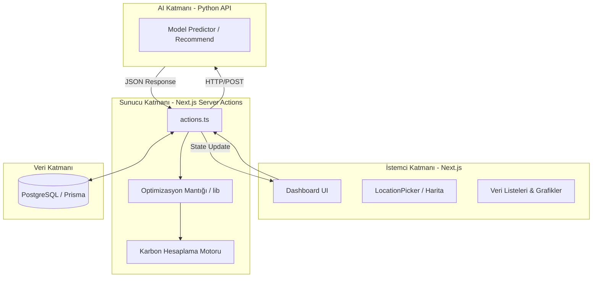

# Troglodyte AI: Veri Merkezi ve Sera Optimizasyon Platformu

Troglodyte AI, modern veri merkezlerinin çevresel etkilerini minimize etmek ve sürdürülebilir tarımı desteklemek amacıyla geliştirilmiş yenilikçi bir karar destek ve optimizasyon platformudur. Bu proje, veri merkezlerinin (Data Centers) operasyonları sırasında açığa çıkan "atık ısıyı" (waste heat), ısıtma maliyetleri yüksek olan seralarla (Greenhouses) akıllı bir şekilde eşleştirerek karbon ayak izini düşürmeyi hedefler.

## Proje Nedir?

Günümüzde yapay zeka ve bulut bilişim sistemlerinin büyümesi, veri merkezlerinin devasa miktarda enerji tüketmesine ve çevreye büyük miktarda ısı salmasına neden olmaktadır. Diğer yandan, tarım sektörü—özellikle seracılık—bitki gelişimi için yıl boyunca sabit ısıya ihtiyaç duyar ve bu ısıyı sağlamak için genellikle fosil yakıtlar kullanılır. 

Troglodyte AI, bu iki sektörü birbirine bağlayan bir köprü görevi görür. Veri merkezlerinin lokasyonlarını, işlem kapasitelerini ve yaydıkları karbon miktarını analiz eder; aynı zamanda seraların kapasitelerini ve karbon ofset potansiyellerini hesaplar. Geliştirilen özel algoritma ve yapay zeka modelleri sayesinde, en düşük mesafe ve en yüksek verimlilikle hangi veri merkezinin hangi serayı beslemesi gerektiğini belirler.

## Nasıl Çalışır?

Sistem, uçtan uca bir veri işleme ve optimizasyon hattı olarak kurgulanmıştır:

### 1. Veri Toplama ve Yönetimi
Sistem, PostgreSQL veritabanı üzerinde Prisma ORM kullanarak veri merkezleri ve seraların coğrafi (enlem, boylam) ve teknik verilerini saklar. `getDatacentersAction` ve `getGreenhousesAction` gibi sunucu eylemleri (Server Actions) üzerinden bu veriler dashboard paneline aktarılır.

### 2. Karbon Ayak İzi ve Ofset Hesaplamaları
Her bir veri merkezi için `calculateDCCarbonFootprint` fonksiyonu çalıştırılarak operasyonel emisyonlar (Mt CO2e) hesaplanır. Seralar için ise `calculateGreenhouseCarbonOffset` fonksiyonu ile sağlanan ısının ne kadarlık bir karbon tasarrufuna denk geldiği belirlenir. Bu, projeyi sadece bir eşleştirme motoru değil, aynı zamanda bir sürdürülebilirlik raporlama aracı haline getirir.

### 3. Optimizasyon Motoru (Relational Mapping)
`getOptimizedDCsToGHsMatrixAction` fonksiyonu projenin kalbidir. Bu motor:
- Mevcut tüm veri merkezlerini ve seraları alır.
- Aralarındaki mesafe matrisini oluşturur.
- En verimli eşleşmeleri (pairing) matematiksel modeller kullanarak hesaplar.
- Sonuçları zenginleştirerek (enriched data) kullanıcıya sunar.

### 4. Yapay Zeka Entegrasyonu (AI Recommendation)
Platform, sadece statik matematiksel hesaplamalarla yetinmez. `callModelAction` fonksiyonu üzerinden yerel veya uzak bir yapay zeka modeline (Python tabanlı backend) bağlanır. Bu model, karmaşık değişkenleri (mevsimsel ısı ihtiyaçları, enerji fiyatları vb.) analiz ederek sistem için ek öneriler ve tahminler üretir.

### 5. Görselleştirme ve Dashboard
Kullanıcı arayüzünde Next.js ve Tailwind CSS kullanılmıştır. `LocationPicker` bileşeni ile harita üzerinde tüm noktalar görselleştirilirken, `Recharts` kütüphanesi ile karbon verileri grafiksel olarak analiz edilebilir. Kullanıcı tek bir butonla (`Get Optimized Route Pairing`) tüm optimizasyon sürecini başlatabilir.

## Teknik Mimari Diyagramı

Aşağıdaki şema, sistemin katmanlı yapısını ve veri akışını temsil etmektedir:



## Kurulum ve Kullanım

### Gereksinimler
- Node.js 18+ ve pnpm/npm
- Python 3.9+ (AI motoru için)
- PostgreSQL veritabanı

### Adımlar

1.  **Depoyu Klonlayın:**
    ```bash
    git clone https://github.com/hulusiby/troglodyte_ai.git
    cd troglodyte_ai
    ```

2.  **Frontend Kurulumu:**
    ```bash
    cd docs
    pnpm install
    cp .env.example .env.local  # Veritabanı ve Model URL'lerini ayarlayın
    npx prisma generate
    pnpm dev
    ```

3.  **AI Motorunu Başlatın:**
    ```bash
    # Ana dizine dönün
    pip install -r requirements.txt
    python main.py --config configs/default.yaml
    ```

## Gelecek Planları

- **Gerçek Zamanlı Veri:** Sensörler aracılığıyla veri merkezlerinden anlık ısı verisi çekilmesi.
- **Blockchain Entegrasyonu:** Karbon ofsetlerinin şeffaf bir şekilde kaydedilmesi.
- **Mobil Uygulama:** Saha ekiplerinin sera kurulumlarını yönetmesi için mobil arayüz.

---
*Troglodyte AI, teknoloji ve doğanın uyum içinde çalışabileceği bir gelecek için geliştirilmiştir.*

---
## İletişim ve Katkı

Bu proje bir hackathon kapsamında geliştirilmiştir. Katkıda bulunmak için lütfen bir Pull Request açın veya sorun (issue) bildirin.